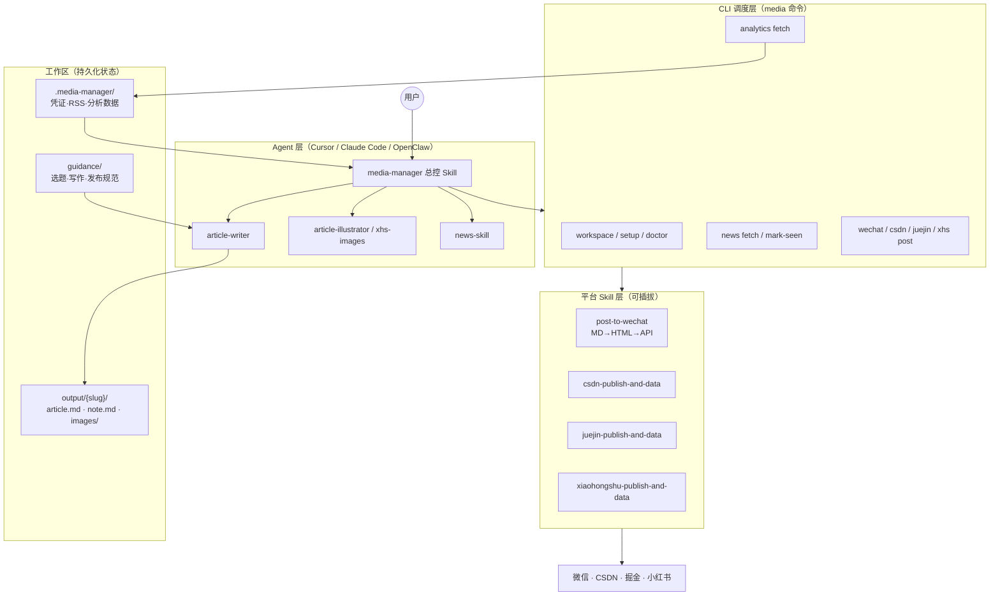

# MediaManager — Agent 端自媒体全链路工具

### demo
https://github.com/user-attachments/assets/6625749e-3600-477f-9a9f-6db01e5c0a21


面向 **Agent 端**（Cursor、Claude Code、OpenClaw 等）的自媒体创作与发布工具：以 Markdown 为统一内容模型，**CLI 执行确定性任务**，**Skill 编排创作流程**，覆盖选题、写作、配图、多平台发布、数据分析与复盘进化。

## 赛事背景与项目定位

本项目面向「多平台内容发布工具」赛题，但**不局限于传统 GUI 应用**——而是顺应当前 Agent 快速普及的趋势，采用 **CLI + Skill** 组合实现赛题要求的多平台发布能力，并进一步打通自媒体创作全链路。

- **赛题范围内**：格式适配、一键（多平台）发布、可扩展架构
- **超出赛题的价值**：RSS 选题、LLM 写作门禁、AI 配图、运营数据复盘、可进化的 personal guidance

## 核心功能与亮点

### 赛题能力对照

| 赛题要求 | MediaManager 实现 |
|----------|-------------------|
| **格式适配** | 统一写入规范 Markdown（`article.md` / `note.md`）；支持 MD 渲染的平台直接发布；微信公众号等不支持 MD 的平台经 HTML 转换后注入编辑器 |
| **一键发布** | Agent 触发 `media wechat post` / `media csdn post` 等 CLI，一次成稿可同步多平台草稿箱 |
| **可扩展架构** | 平台以 Skill + CLI 子命令插件化接入；新增平台只需实现发布脚本并注册到 `media` 调度层 |

### 为什么选择 Agent 端而非传统应用

- **自然语言驱动**：用户在 Agent 中说「写一篇关于 X 的文章并发布到微信和 CSDN」，由 `media-manager` 总控 Skill 编排全流程
- **LLM 与 CLI 分工明确**：需要创意与分析的任务（选题、写作、复盘）交给大模型；确定性任务（RSS 抓取、API 发布、数据拉取）交给 CLI
- **零 GUI 维护成本**：无需为每个平台单独做 UI，平台变更只需更新对应 Skill 脚本

### 全链路自媒体工作流

| 阶段 | 能力 | 执行主体 |
|------|------|----------|
| 选题 | RSS 聚合、热点筛选、去重 | LLM + `media news fetch` |
| 写作 | 长文 / 小红书笔记、提纲门禁 | `article-writer` Skill |
| 润色 & 配图 | 风格调整、AI 配图、小红书信息图 | LLM + `article-illustrator` / `xhs-images` |
| 发布 | 多平台草稿 / 正式发布 | `media * post` CLI |
| 数据分析 | 各平台阅读 / 互动数据抓取 | `media analytics fetch` |
| 复盘进化 | 洞察落盘到 `guidance/`，影响下次创作 | LLM + `analyze-operation` 工作流 |

### 格式适配策略（Write Once, Publish Everywhere）

- **长文内容族**（微信 / CSDN / 掘金）：共用一篇 `article.md` + `images/`
  - CSDN / 掘金：原生 Markdown 渲染，直接插入
  - 微信公众号：MD → 主题化 HTML（代码高亮、脚注、外链转底部引用）→ 官方 API 写入草稿箱
- **小红书内容族**：独立 `note.md` + `xhs-images/` 轮播图，适配短图文形态
- **平台差异**：标题 / 摘要等元数据通过 frontmatter + `guidance/publishing/platform/*.md` 在发布期适配

| 平台 | 发布方式 | 说明 |
|------|----------|------|
| 微信 / CSDN / 掘金 | **保存草稿** | 自动写入各平台草稿箱并返回后台编辑链接（微信另返回 media_id）；需人工审阅后再正式发布 |
| 小红书 | **正式发布** | 笔记发布后即上线；创作中心草稿为本地浏览器保存，无法跨设备共享，故不使用草稿流程 |

### 亮点摘要

1. **Agent-Native**：面向 Agent 端的自媒体全流程工具，CLI + Skill 双轨架构
2. **内容族抽象**：按内容形态（longform / xhs）而非平台数量组织，降低适配成本
3. **可进化的 Guidance**：复盘洞察自动沉淀为个人创作规范，越用越贴合你的风格
4. **安全发布默认**：微信 / CSDN / 掘金默认进草稿箱，人工审阅后再上线
5. **开源 Skill 生态**：集成 baoyu-skills、media-skills 等成熟能力，并支持自定义扩展

## 架构设计与实现原理

### 设计原则

| 原则 | 说明 |
|------|------|
| **Agent 编排、CLI 执行** | Skill 负责理解意图与流程门禁；CLI 负责确定性 I/O（文件、API、浏览器自动化） |
| **工作区驱动** | 所有产物与配置落在统一工作区，Agent 会话结束后状态可复现 |
| **内容族 > 平台数** | 按 longform / xhs 两种形态组织，三平台长文共用一篇 MD，避免 N×M 适配矩阵 |
| **插件化平台** | 每个平台 = 独立 Skill 目录 + CLI 子命令 + 可选 guidance 模板 |

### 架构总览



### 三层架构

#### 1. Agent 层 — 意图理解与流程编排

- **`media-manager`**：总控入口，根据用户意图路由到四条标准工作流（见 [工作流](#工作流)）
- **子 Skill**：各阶段 deep-dive（写作、配图、资讯、单平台发布细节）
- **LLM 门禁**：选题 / 提纲 / 初稿 / 发布前须用户确认，避免 Agent 擅自发布

#### 2. CLI 层 — 确定性任务调度

Monorepo 包职责：

| 包 | 职责 |
|----|------|
| `@dsmlll/media-manager-core` | 工作区路径、配置类型、guidance 模板 seed |
| `@dsmlll/media-manager-platform-common` | 各平台 CLI 共享逻辑 |
| `@dsmlll/media-manager-runtime` | Skill 运行时复制、依赖安装 |
| `@dsmlll/media-manager-cli` | `media` 命令入口与 dispatch 路由 |

CLI 不做内容创作，只做：环境自检、RSS 抓取、调用 Skill 脚本发布、拉取运营数据、Skill 安装 / 更新。

#### 3. Skill 层 — 平台适配与脚本执行

每个平台 Skill 自包含：

- `SKILL.md`：Agent 可读的操作说明与参数约定
- `scripts/`：发布 / 鉴权 / 数据抓取脚本（TypeScript + Playwright / 官方 API）
- `references/`：平台特有配置与故障排查

**格式转换示例（微信公众号）**：

```text
article.md → Markdown 解析器（主题 / CSS / 代码高亮）
          → HTML 片段
          → 微信草稿箱 API（media wechat post）
          → 返回草稿编辑链接
```

CSDN / 掘金则跳过 HTML 转换，直接将 Markdown 正文写入平台编辑器。

### 数据流：从输入到发布

```text
用户自然语言需求
    ↓
media-manager 确认平台 & 加载 guidance
    ↓
[选题] news-skill / 用户素材 → 用户确认
    ↓
[写作] article-writer → output/{slug}/article.md
    ↓
[配图] article-illustrator → output/{slug}/images/
    ↓
[发布] media csdn post --file article.md --draft
       media wechat post article.md
       media xhs post-note note.md --images xhs-images/
    ↓
[复盘] media analytics fetch --all → guidance/ 更新
```

### 扩展新平台（以「知乎」为例）

1. 在 `skills/` 新建 `zhihu-publish-and-data/`，实现 `scripts/post.ts`
2. 在 `packages/cli` 注册 `media zhihu post` 子命令
3. 添加 `guidance/publishing/platform/zhihu.md` 发布元数据规范
4. 更新 `platform-families.md` 映射表
5. 在 `media-manager` 工作流中增加平台选项

无需改动 Agent 编排逻辑或工作区结构。

### 工作流同步机制

Workflow 定义以 `skills/media-manager/references/workflows/` 为 canonical 源，`npm run build` 自动镜像到 `.cursor/commands`、`.claude/commands` 等，保证多 Agent 端体验一致。详见 [docs/sync.md](docs/sync.md)。

## 安装

### Mode B（推荐终端 / Agent 端用户 — 在 Claude Code、Cursor、OpenClaw 等 Agent 端使用）

```bash
npm install -g @dsmlll/media-manager-cli
media setup
media doctor
```

安装时交互设置工作区（默认 `Documents/MediaManager-Workspace`），配置平台登录凭证与 API 密钥，并自动安装 Skills。详见 [docs/install.md](docs/install.md)。

### Mode A（开发者）

```bash
git clone https://github.com/LDJ-creat/MediaManager.git
cd MediaManager
npm install && npm run build
media doctor
```

Repo 根目录即工作区（`.media-manager/repo-marker.json`）。

## 核心命令

| 命令 | 说明 |
|------|------|
| `media setup` | 初始化工作区、登录凭证、API 密钥与 Skills（二次运行展示摘要） |
| `media config show` | 查看凭证 / API 配置状态（不输出密钥明文） |
| `media workspace show` | 显示当前工作区路径 |
| `media doctor` | 环境自检 |
| `media news fetch` | 抓取 RSS 资讯 |
| `media news sources edit` | 编辑工作区 RSS 源 |
| `media analytics fetch --all` | 抓取各平台运营数据 |
| `media skill install` | 安装 Skills（默认 cursor + claude + codex） |
| `media skill update` | 更新 Skills |
| `media skill uninstall` | 卸载 Skills |

完整契约见 [docs/cli-contract.md](docs/cli-contract.md) 与 [skills/media-manager/references/cli-contract.md](skills/media-manager/references/cli-contract.md)。

## 工作流

以下四条工作流对应 [架构总览](#架构总览) 中的 Agent 编排层：

1. **daily-digest** — RSS → 筛选 → 中文日报 → 去重（仅素材，不写作）
2. **write-and-publish** — 选题 → 写作 → 配图 → 多平台发布（无素材时可先 daily-digest）
3. **publish-only** — 已有成稿 → 选平台 → CLI 发布（不改写正文）
4. **analyze-operation** — 数据抓取 → 复盘 → 更新 guidance

定义见 `skills/media-manager/references/workflows/`（canonical）；`npm run build` 或 `npm run sync:workflows` 自动镜像到 `.agents/workflows`、`.cursor/commands`、`.claude/commands`、`.github/instructions/`。详见 [docs/sync.md](docs/sync.md)。

## 工作区目录

```text
{workspace}/
├── output/{slug}/
│   ├── article.md          # longform（微信/CSDN/掘金）
│   ├── note.md             # 小红书
│   ├── images/             # 长文配图
│   └── xhs-images/         # 小红书轮播图
├── guidance/               # 个人工作区（gitignore，setup 时从模板 seed）
│   ├── topic-selection/    # general, longform, platform/xiaohongshu
│   ├── writing/
│   ├── publishing/platform/
│   └── analytics/platform/
└── .media-manager/
    ├── news/sources.json   # RSS 源（Mode B 由 media news sources edit 管理）
    └── …
```

详见 [docs/workspace.md](docs/workspace.md)。

## Skill 布局

所有 Skill 位于 `skills/`，对应 [架构总览](#架构总览) 中的 Agent 层与平台 Skill 层：

| Skill | 用途 |
|-------|------|
| **media-manager** | 总控编排（工作流入口） |
| article-writer | 长文 / 小红书笔记写作 |
| article-illustrator | 长文自动配图 |
| xhs-images | 小红书信息图轮播 |
| news-skill | 每日科技资讯 RSS |
| post-to-wechat | 微信公众号发布 |
| baoyu-image-gen | AI 图片生成（未配置 API 时，若 Agent 端支持，则降级为 Agent 内置图片生成） |
| csdn / juejin / xiaohongshu-publish-and-data | 平台发布与数据 |
| get-wechat-data | 公众号数据分析 |

子 Skill 为 deep-dive；多步流程请从 **media-manager** 或上述工作流入手。

## 上游 Skill 与致谢

部分 Skill 集成自开源项目，并向原作者致谢：

| 本仓库 Skill | 来源 |
|--------------|------|
| `baoyu-image-gen` | [JimLiu/baoyu-skills · baoyu-image-gen](https://github.com/JimLiu/baoyu-skills/tree/main/skills/baoyu-image-gen) |
| `xhs-images` | 基于 [JimLiu/baoyu-skills · baoyu-xhs-images](https://github.com/JimLiu/baoyu-skills/tree/main/skills/baoyu-xhs-images) 改造，详见 [改造说明](skills/xhs-images/ATTRIBUTION.md) |
| `post-to-wechat`、`csdn-publish-and-data`、`juejin-publish-and-data`、`xiaohongshu-publish-and-data`、`get-wechat-data` | 微信 / CSDN / 掘金 / 小红书的自动发布与运营数据抓取，复用自 [LDJ-creat/media-skills](https://github.com/LDJ-creat/media-skills) |

## Skills 管理

```bash
media skill install
media skill update
media skill uninstall
```

**Deprecated（开发兜底）：** `sync-skills.ps1` / `sync-skills.sh` 仍可用于 monorepo 本地同步。Skill 与工作流同步策略见 [docs/sync.md](docs/sync.md)。

## 配置

- 微信 / 图片 API：各 Skill 目录下 `.env`（参考 `.env.example`）
- 平台登录态：`media csdn auth export` 等，凭证存于 `.media-manager/auth/`
- RSS 源：
  - **Mode B（CLI 用户）**：`$WORKSPACE/.media-manager/news/sources.json`，运行 `media news sources edit` 编辑；`media news fetch` 优先读该文件，不存在时使用 CLI 内置默认源
  - **Mode A（开发者）**：可直接编辑 `skills/news-skill/references/sources.json`，或使用工作区配置（同上）

## 开发与发布

```bash
npm run build          # 含 skills → runtime 复制与工作流镜像同步
npm run sync:workflows # 仅同步 workflows → .agents / .cursor / .claude / .github
npm test
./scripts/smoke-install.ps1
```

发布流程见 [.github/workflows/release.yml](.github/workflows/release.yml)。OpenClaw / ClawHub 可选发布见 [docs/openclaw-clawhub.md](docs/openclaw-clawhub.md)。Skill / Workflow 同步说明见 [docs/sync.md](docs/sync.md)。

---

仅供学习与自媒体运营效率提升，请遵守各平台使用规范。
